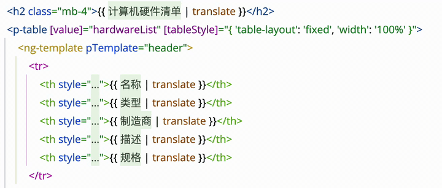

# ngx-translate-intellisense

<!-- Plugin description -->
This IntelliJ IDEA plugin enhances the development experience for Angular applications using ngx-translate. It provides
intelligent code completion, inline hints, and navigation features for translation keys, making internationalization
development more efficient and enjoyable. The plugin automatically detects Angular and Nx projects with ngx-translate
installed and seamlessly integrates with your existing workflow.

Key features include smart autocomplete for translation keys, inline display of translation values, quick navigation to
translation definitions, and a dedicated tool window for browsing translations. The plugin is optimized for performance
with efficient caching and supports multiple locale file formats commonly used in Angular applications.
<!-- Plugin description end -->


[](https://plugins.jetbrains.com/plugin/29011-ngx-translate-intellisense)
[](https://plugins.jetbrains.com/plugin/29011-ngx-translate-intellisense)

## Features

- **🔧 Smart Code Completion** - Get intelligent autocomplete for translation keys in your TypeScript and Angular
  templates
- **👁️ Inlay Hints** - See translation values displayed inline with your code for better context
- **🔗 Reference Navigation** - Jump directly to translation definitions with Ctrl+Click / Cmd+Click
- **🪟 Dedicated Tool Window** - Browse and manage all your translation files from a convenient side panel
- **⚡ High Performance** - Efficient caching ensures minimal impact on IDE performance
- **🎯 Project Detection** - Automatically activates for Angular and Nx projects with ngx-translate

## Installation

### From JetBrains Marketplace

1. Go to **File** → **Settings** → **Plugins**
2. Search for "ngx-translate-intellisense"
3. Click **Install** and restart your IDE

### Manual Installation

1. Download the latest release
   from [GitHub Releases](https://github.com/ahmedwelhakim/jetbrains-ngx-translate-intellisense-plugin/releases/latest)
2. Go to **File** → **Settings** → **Plugins**
3. Click the gear icon ⚙️ and select **Install plugin from disk...**
4. Choose the downloaded plugin file

## Usage

### Code Completion

Start typing a translation key in any string literal context and press `Ctrl+Space` to see available suggestions:

```typescript
// Before
this.translateService.instant('')

// After - press Ctrl+Space
this.translateService.instant('welcome.message') // Shows completion
```

### Inlay Hints

Translation values appear inline next to your keys:

```typescript
this.translateService.instant('welcome.message') // "Welcome to our application!"
```

### Code Folding

Translation values override i18n keys, when you enable "Hide Translation Keys" in the plugin setting :

``` html
<h1>{{'SYSTEM.WELCOME.HELLO'|translate}}</h1>

// now display as below with code folding background:
<h1>你好</h1>
```




when you click on translation values, it will switch back to i18n keys

and when you click on other line, i18n keys will automaticly display as translation values


### Reference Navigation

Click on any translation key while holding `Ctrl` (or `Cmd` on Mac) to jump directly to its definition in your JSON
translation files.

### Tool Window

Access the translation browser from the right side panel to:

- View all translation keys and their values
- Navigate between different locale files
- Quickly search for specific translations

## Configuration

Configure the plugin settings via **File** → **Settings** → **Tools** → **Ngx Translate Intellisense**:

- **Translation Directories**: Specify where your translation files are located
- **Inlay Hints**: Toggle inline translation display and set maximum text length
- **File Patterns**: Customize file naming conventions for translation files

## Requirements

- IntelliJ IDEA Ultimate 2024.3 or later
- WebStorm 2024.3 or later
- Angular plugin enabled
- Project must use @ngx-translate/core

## Supported File Patterns

The plugin automatically detects translation files matching these patterns:

- `en.json`, `fr.json`, `de.json` (language code only)
- `en-US.json`, `fr-FR.json`, `de-DE.json` (language + country code)

## Contributing

Contributions are welcome! Please feel free to submit a Pull Request. For major changes, please open an issue first to
discuss what you would like to change.

## Development

This plugin is built with:

- Kotlin
- IntelliJ Platform Gradle Plugin
- Java 21

To build the plugin locally:

```bash
./gradlew build
```

## License

This project is licensed under the MIT License - see the [LICENSE](LICENSE) file for details.

## Changelog

See [CHANGELOG.md](CHANGELOG.md) for a list of changes and version history.

## Support

If you encounter any issues or have feature requests, please:

- Check existing [GitHub Issues](https://github.com/ahmedwelhakim/jetbrains-ngx-translate-intellisense-plugin/issues)
- Create a new issue with detailed information
- Include your IDE version and plugin version
